<p align="center">
  <picture>
    <source media="(prefers-reduced-motion: reduce)" srcset="./assets/izmysh-banner-static.svg" />
    
  </picture>
</p>

<p align="center">
  <code>independent developer</code> &nbsp; <code>curious by default</code> &nbsp; <code>RU / EN</code>
</p>

## Personal protocol

```text
identity   IZMYSH
origin     Mysh → Izmysh
approach   curiosity → clarity → useful things
```

I turn everyday friction into useful tools. I care about clear interfaces,
simple systems, and the small details that make something feel complete.

## Working principles

**Build with intent.** Start with a real problem, not another feature.  
**Keep the signal clear.** Less noise, more meaning.  
**Finish the small things.** Motion, copy, and edge cases are part of the work.


<br />

<p align="center">
  
</p>
<p align="center"><sub>Same mouse. Bigger ideas.</sub></p>
